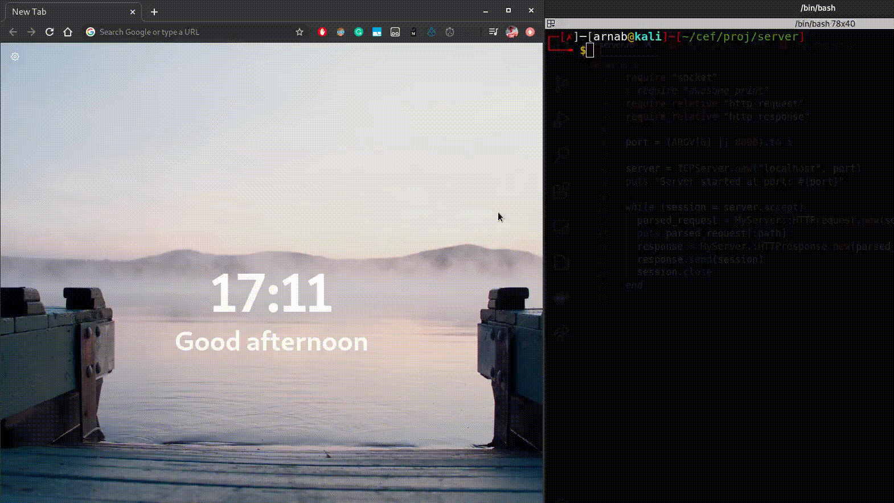

# HTTP server using Ruby

A simple HTTP server built with Ruby. It simply renders the `index.html` or other files in the directory.

I have made a detailed explanation here: https://arnabsen.rocks/posts/building_server_from_scratch/

## How to run

Simply run the ruby script

```bash
$ ruby server.rb <port-number>
```

Then visit `http://localhost:<port-number>/`

## Final Product


